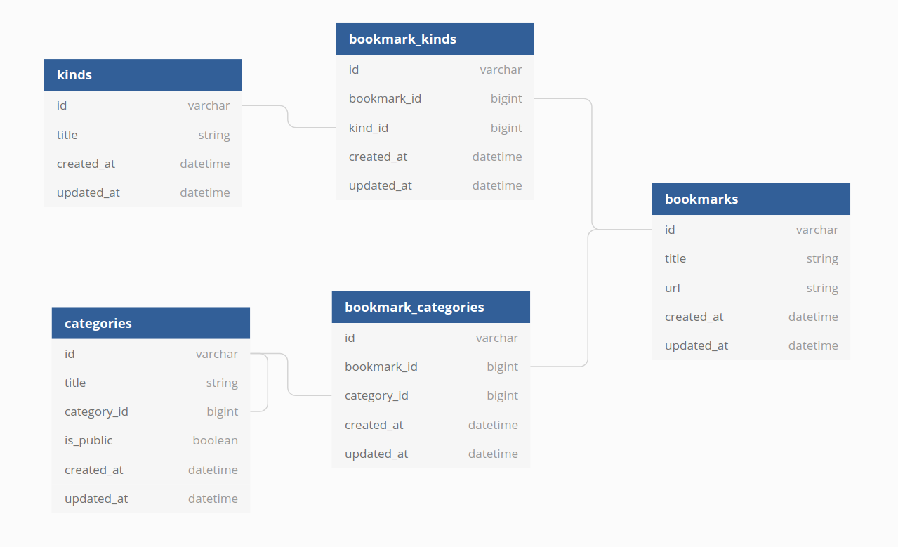

# Bookmarks manager

## Overview
This project allows to manage your website bookmarks and classify them on Categorys and Types. 

## Project DB

This DB allows to save your bookmarks and classify them on several Categories and Types. 

*Note: Kinds its used instead of Types*

## Website Navigation
This poroject count with 4 main views with their respective links on the navbar

### Bookmarks (Home)
This view shows all your bookmarks and their classification. Here you can also create new bookmarks.

### Categories
This view shows all your categories and their statistics.
Also you can change the visibility of the category and their subcategories. 

*Note: When you change the visibility of a Category, all subcategories associated will set the same visibility value*

*Note: When visibility is setted on Private you can't access to category's details. Private categories can't be associated to a new bookmark, so they don't appear on the "New Bookmark" form*

On the show link of each category you can see the category overview and the bookmarks associated

### Types
This view shows all your Types and their statistics.
On the show link of each type you can see the type overview and the bookmarks associated

### Statistics
This view shows the distribution of your bookmarks on Categories and Types

